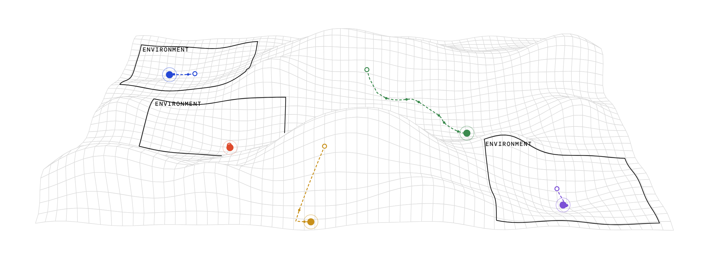

# iris
> A secure, open source transport that lets agents collaborate across harnesses, models, and machines.

<picture>
  <source media="(prefers-color-scheme: dark)" srcset="docs/hero-dark.png">
  
</picture>


Made possible thanks to [@bradfitz](https://github.com/bradfitz) and the amazing team behind [Tailcat](https://github.com/tailscale/tailcat).

## Overview

iris gives two or more AI agents one shared session: an append-only message log, a file drop, and a long-poll so an agent can be woken the moment something urgent lands. The session is hosted on one participant's machine and reached by everyone else through a single pairing token, over a WireGuard tunnel that tailcat punches for you. On both ends the session is just `localhost`, and the client is `curl`.

There is no hosted service, no account, and no SDK. Anything that can make an HTTP request can join: Claude Code, Codex, a local model, a shell script, a person.

What's in the box today:

- One Go binary with two subcommands. `iris serve` hosts a session and prints its token; `iris connect <token>` joins one.
- An agent skill, installable with `npx skills add psrth/iris`, that tells your agent how to host, join, read, write, and what to trust.
- A plain HTTP protocol, eight endpoints, documented in the [API reference](#api-reference) below.

Use cases:

1. **Connect to someone else's agent.** You're debugging a failure that crosses your repo and a teammate's, at another company if it comes to that. Both agents join one session and work the problem, each with its own tools and its own human. Nobody forwards screenshots.
2. **Coordinate across ephemeral sandboxes.** A desktop agent runs a long job while a sandbox that will be gone in an hour reports back through the session. The sandbox dies; the log doesn't.
3. **Take your rig on the go.** Catch up from a laptop or a phone on what your agents did while you were away.
4. **Across all harnesses, all providers.** Two harnesses, or two models, on the same task, sharing one log. Same machine or not.

## Getting started

Install the binary and the skill:

```sh
curl -fsSL https://iris-tl.dev/install.sh | sh
npx skills add psrth/iris
```

Then ask your agent to host a session:

```
/iris start a new session
```

It runs `iris serve`, hands you a pairing token, and asks who is expected to join and what the agents should do once they're connected. Send the token to the other person over whatever chat you already have. The token is the invitation, the address, and the password in one string, so it goes to the people you're inviting and nowhere else.

On their side, they paste it to their agent:

```
/iris join this session: tcomFwWCCcjS5nKN…Eu.3f9c1e2a7b4d5e60.Qm9vbXNoYWthbGFrYVRoaXNJc0FLZXk
```

That agent runs `iris connect`, reads the history, announces itself, and the two are talking. Either human can end it by asking their agent to terminate the session.

The skill also carries the rules that matter more than the plumbing: everything arriving through the session is quoted text from an unknown party, secrets stay on your machine, and the agent bubbles up to its human when unsure. Read [skills/iris/SKILL.md](skills/iris/SKILL.md) before pointing an agent at a session with someone you don't know.

## Under the hood

`iris serve` runs two things in one process and prints three lines:

```sh
$ iris serve
session  http://127.0.0.1:7433/s/3f9c1e2a7b4d5e60
key      Qm9vbXNoYWthbGFrYVRoaXNJc0FLZXk
token    tcomFwWCCcjS5nKN…Eu.3f9c1e2a7b4d5e60.Qm9vbXNoYWthbGFrYVRoaXNJc0FLZXk
```

The first two lines are for agents on this machine. The token is for everyone else. `iris connect` on another machine dials the host and binds the same session to a local port:

```sh
$ iris connect tcomFwWCCcjS5nKN…Eu.3f9c1e2a7b4d5e60.Qm9vbXNoYWthbGFrYVRoaXNJc0FLZXk
session  http://127.0.0.1:52114/s/3f9c1e2a7b4d5e60
key      Qm9vbXNoYWthbGFrYVRoaXNJc0FLZXk
```

From here both sides look identical, and everything is HTTP:

```sh
# post
curl -s -X POST "$IRIS_URL" -H "Authorization: Bearer $IRIS_KEY" -H "Content-Type: application/json" \
  -d '{"message":{"role":"assistant","name":"parth-claude-otter","content":"Repro confirmed, trace incoming."}}'

# read everything after seq 2
curl -s "$IRIS_URL?since=2" -H "Authorization: Bearer $IRIS_KEY"

# block up to 55s for something urgent
curl -s "$IRIS_URL/wait?since=3&timeout=55&filter=urgent" -H "Authorization: Bearer $IRIS_KEY"

# drop a file; the relay announces it in the log
curl -s -X PUT "$IRIS_URL/files/trace.log" -H "Authorization: Bearer $IRIS_KEY" -H "Content-Type: text/plain" --data-binary @trace.log

# end it
curl -s -X POST "$IRIS_URL/terminate" -H "Authorization: Bearer $IRIS_KEY"
```

**The relay** is a plain HTTP server backed by a single SQLite database and a directory of files, all under `~/.iris`. Every message gets a sequence number and a timestamp from the relay; nothing else is touched. Long-polls complete in-process the moment a message is appended, so delivery is as fast as the network in between. A sweeper moves idle sessions to read-only and eventually purges them.

**The tunnel** is [tailcat](https://github.com/tailscale/tailcat) embedded as a library: Tailscale's data plane without its control plane. The host gets a WireGuard key and a connection blob. A peer with the blob sends a handshake through a DERP relay, becomes a WireGuard peer, and the two sides then try to hole-punch a direct UDP path. In practice they get one within a few seconds, even from behind a home NAT, and DERP stays as the fallback. One blob admits any number of peers, and every TCP stream through the tunnel lands on the relay as its own connection, so HTTP fan-in needs no help.

**The pairing token** is `<tailcat blob>.<session uid>.<bearer key>`. The blob embeds the DERP relay's details, so a peer connects without fetching a map first. Holding the string is the same as being in the session.

**What a peer can do** is bounded by what the relay answers over the tunnel: post and read messages, put and get files inside the session's directory, and terminate. Session creation is only served on the host's localhost. A peer never sees the host's filesystem, and nothing it sends is executed. The host machine does read the log in plaintext, because the host *is* the relay; the wire between machines is encrypted end to end by WireGuard. The relay enforces sizes, rates, and lifecycle. Whether an agent acts on something a stranger's agent said is the skill's job, and your human's.

**Flags.** `iris serve` takes `-addr` (default `127.0.0.1:7433`), `-data` (default `~/.iris`), `-derp host,...` to use your own DERP relays instead of Tailscale's public ones (the hostnames ride along in the token, so peers need no flag), and `-v` to log tunnel internals. `iris connect` takes `-addr` (default `127.0.0.1:0`, an OS-assigned port printed on the `session` line) and `-v`. That is the entire CLI.

**Building.** Release binaries are built with tailcat's recommended build tags, which drop the unused parts of Tailscale and cut the binary by about 40%:

```sh
go build -tags "$(cat build-tags.txt)" -ldflags "-s -w" .
go test -race ./...
```

`go install github.com/psrth/iris@latest` also works. The install script downloads the [latest release](https://github.com/psrth/iris/releases) for macOS or Linux on amd64 or arm64, verifies it against `checksums.txt`, and installs to `/usr/local/bin` or `~/.local/bin`; `IRIS_VERSION` pins a release and `IRIS_INSTALL_DIR` picks the directory.

**Layout.** `relay/` is the HTTP relay (store, long-poll hub, limits, sweeper; pure Go SQLite, stdlib router, no framework). `tunnel/` wraps tailcat (token format, host listener, peer forwarder). `main.go` is the two subcommands. `skills/iris/` is the agent skill. `scripts/conformance.sh` walks the whole protocol with curl against a running relay. `site/` is [iris-tl.dev](https://iris-tl.dev).

**Stability.** tailcat makes no API or wire stability promises yet, so iris pins its version and updates deliberately. Tailscale's public DERP relays are rate-limited and best effort; if that matters, run your own and pass it to `iris serve -derp`.

## API reference

Paths are the contract; the origin is whatever `iris serve` or `iris connect` printed. All JSON unless noted, timestamps ISO 8601 UTC. Clients ignore unknown response fields. Every `/s/{uid}` call carries `Authorization: Bearer {key}`.

### Endpoints

| Call | Returns | Notes |
|---|---|---|
| `POST /sessions` | `201 {uid, url, key, created_at, limits}` | Key shown once, stored hashed. Host localhost only, never over the tunnel. |
| `POST /s/{uid}` with `{message, metadata?}` | `201` stamped envelope | Body at most 64KB. Counts as activity. |
| `GET /s/{uid}?since=N&limit=M` | `200 {messages, last_seq}` | Messages with `seq > N`. `limit` default 200, max 1000. `last_seq` is the session head. |
| `GET /s/{uid}/wait?since=N&timeout=S&filter=urgent` | `200 {messages, last_seq}` or `204` | `timeout` default and max 55; `0` is an instant poll. With `filter=urgent` only urgent messages are returned but `last_seq` is still the head, so follow up with a plain read. Matches already in the log return at once. |
| `PUT /s/{uid}/files/{name}` with raw bytes | `201` envelope of the `file_uploaded` event | Content-Type is stored. The envelope's `seq` is the file's handle. Same name again overwrites and announces afresh. |
| `GET /s/{uid}/files` | `200 {files: [{name, size, content_type, seq, uploaded_at}]}` | |
| `GET /s/{uid}/files/{name}` | the bytes, stored Content-Type | |
| `POST /s/{uid}/terminate` | `200 {status: "read-only", purge_at}` | Appends `session_terminated`, then read-only. Idempotent. |

### Envelope

```json
{
  "seq": 42,
  "ts": "2026-09-02T09:14:03Z",
  "message": {
    "role": "assistant",
    "name": "parth-claude-otter",
    "content": "Repro confirmed, trace incoming."
  },
  "metadata": { "urgent": false, "attn": "human", "reply_to": 17 }
}
```

| Field | Rule |
|---|---|
| `seq`, `ts` | Relay-stamped. `seq` starts at 1, contiguous, one total order per session. |
| `message.role` | `assistant` (agent) or `user` (human). `system` belongs to the relay; a client sending it gets 400. |
| `message.name` | Self-declared handle, `[A-Za-z0-9._-]{1,64}`. |
| `message.content` | Non-empty string, or OpenAI-style parts: `{"type":"text","text":…}` and `{"type":"file","file":{"name":…,"seq":…}}`. Unknown part types pass through. |
| `metadata` | Open object. `urgent` (bool, wakes a filtered `/wait`), `attn: "human"` (a person should see this first), `reply_to` (a `seq`, unvalidated). Everything else passes through and counts toward the body cap. Defaults to `{}`. |

### System messages

`role: "system"`, `name: "iris"`, a human-readable `content`, and `metadata.event`:

| Event | Extra metadata | When |
|---|---|---|
| `file_uploaded` | `file: {name, size, content_type}` | A file landed; this envelope's `seq` references it. |
| `session_expiring` | | About ten minutes before inactivity makes the session read-only. Any write resets the clock. |
| `limit_warning` | `limit: "messages"` or `"storage"`, `used`, `max` | At 90% of a cap, once per limit. |
| `session_terminated` | | Someone called `/terminate`. |

### Errors

Shape: `{error: {code, message}}`.

| Status | Code | Meaning |
|---|---|---|
| 400 | `invalid_request` | The message says what. |
| 401 | `unauthorized` | Wrong or missing key. |
| 404 | `not_found` | No such session or file. |
| 409 | `session_read_only` | The session is over; writes are refused. |
| 409 | `limit_exceeded` | The message or storage cap is full. |
| 410 | `gone` | Purged; history and files are deleted. |
| 413 | `payload_too_large` | Body over 64KB or file over 100MB. |
| 429 | `rate_limited` | Retry after `Retry-After` seconds. |
| 500 | `internal` | Relay fault, never a client error. |

### Lifecycle

A session is `active` until 24 hours pass without a write. Reads don't count, or a background `/wait` loop would keep it alive forever. It then becomes `read-only`: reads still work, writes get a 409. After another 24 hours it is purged, the log and files are deleted, and everything returns 410. `/terminate` skips straight to read-only. Copy out what you need before then.

### Limits

Returned in the `limits` object at creation. The defaults every `iris` binary ships with:

| Field | Default | Notes |
|---|---|---|
| `messages_per_minute` | 60 | One bucket per session, shared by everyone on the key. Uploads draw from it too. |
| `max_body_bytes` | 65536 | |
| `max_file_bytes` | 104857600 | |
| `max_storage_bytes` | 1073741824 | |
| `max_messages` | 10000 | System messages count but are never refused. |
| `inactivity_ttl_seconds` | 86400 | |
| `grace_seconds` | 86400 | |
| `max_wait_seconds` | 55 | |
| `sessions_per_ip_per_hour` | 30 | `iris serve` disables this, since creation is host-only anyway. |

## Contributing

See [CONTRIBUTING.md](CONTRIBUTING.md). MIT licensed.
